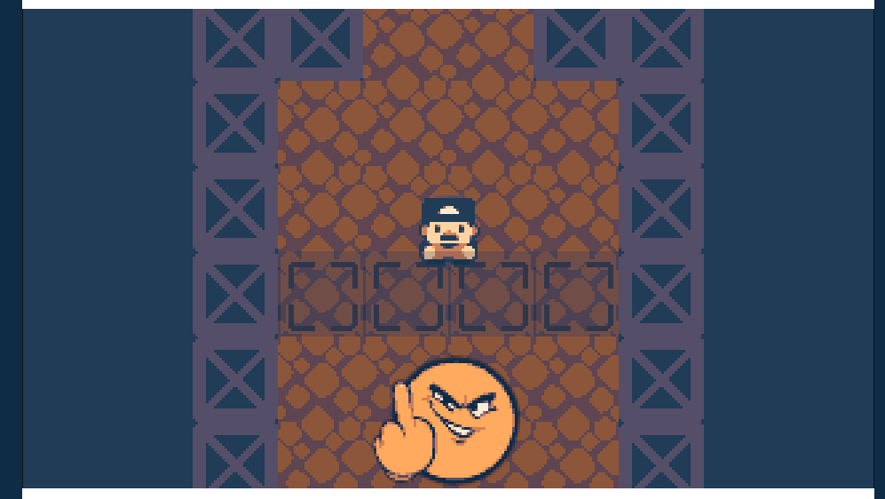
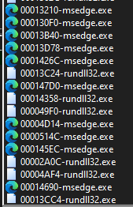
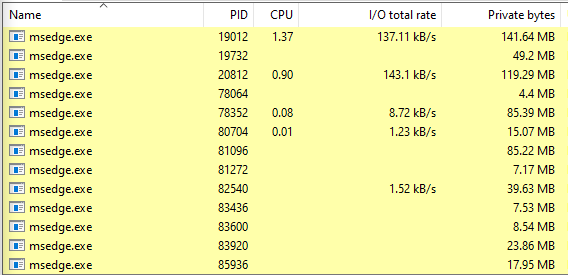
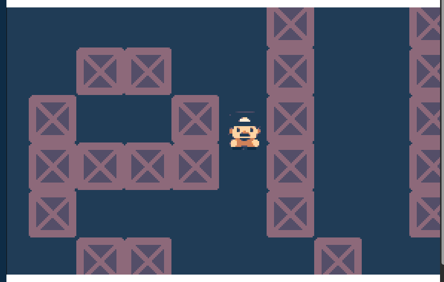

# Impossible Maze Solve - Playtester Solution (oh_word)

Even though the disclaimer on the website states that the game is impossible, we can still play around to see what the game is about.

Navigating through the small maze, you'll eventually come across what looks like an exit, but you're blocked off and can't get through.

So the goal is clear, get through the wall. This is just a typical "changing your position" game hacking challenge with the twist that the game is hosted on a website. For reference, I solved this challenge on Windows 10 using Microsoft Edge as my browser, but you can use whatever OS and whatever browser (probably).

To mess around with memory, I chose to use Cheat Engine. After trying to load Edge with Cheat Engine, you'll notice that there's a lot of processes to choose from:

So how can we narrow down which one will contain the game itself to change the coordinates?

There's many routes you can take to figure this out, but I ended up using [Process Hacker](https://processhacker.sourceforge.io) which shows a ton of information about a process, including `I/O Total Rate`. Since this game reads input from your keyboard to move around, we can assume that a process with a higher I/O rate is the one we want to target.

We can see that the first and third processes have a decently high I/O Total Rate, so it was a 50/50 pick but I went with the first one since it also had a higher `CPU` value. Convert the PID to hex, and then select it in the Cheat Engine process list.

From this point, you just do the normal steps to find the coordinates of a player in a game like this. I do a `New Scan` with the settings `Scan Type: Unknown initial value` and `Value Type: Float`. You'll get millions of results, but then you can move around a bit, then set `Scan Type: Changed value` and do a `Next Scan`, wait a bit without moving, set set `Scan Type: Unchanged value`, do a `Next Scan`, rinse and repeat.

Eventually, you'll get it narrowed down to ~200 results. It might be more or less depending on how long you do it for and how accurate you are. Move all the results down to the result table, and from there you just manually search through values until you find the correct address that holds the player's position. Set the `y` value to a position under the wall, and you'll find the flag spelled out with wall blocks!

(You have to move around to see the whole flag, but here's a snippet of it)
